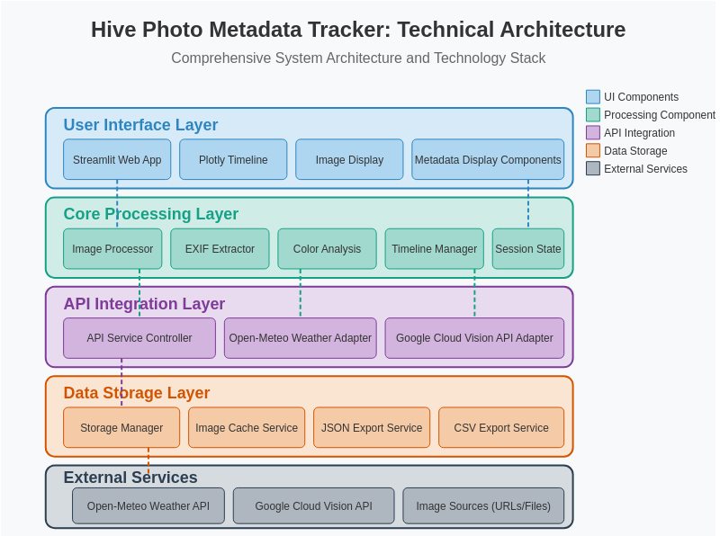

# 🐝 Hive Photo Metadata Tracker

A Streamlit application that helps beekeepers analyze and organize photos of their hives with rich metadata.

<div style="text-align: center; min-width: 250px;">
  <a href="src/default_beepic.jpg" target="_blank">
  
  </a>
</div>

## Project Overview
<div style="display: flex; align-items: top; justify-content: space-between; flex-wrap: wrap;">
  <div style="flex: 1; min-width: 350px;">
The Hive Photo Metadata Tracker is a web app designed for beekeepers to organize, analyze, and extract insights from their hive inspection photographs. As I roll-out the features in my implementation strategy, my vision is of an app that transforms unstructured photo collections into a structured, searchable knowledge base that enhances beekeeping management practices.
<h3> Business Value</h3>
This solution addresses a critical need in apiculture by leveraging modern data techniques to:
<ul>
<li>Streamline documentation of hive inspections through automated metadata extraction</li>
<li>Visualize inspection timelines for better seasonal planning and hive health monitoring</li>
<li>Create a searchable knowledge base that correlates visual data with environment conditions</li>
<li>Enhance decision-making by connecting weather data with inspection findings</li>
</ul>
<h3>  Key Features  </h3>
<ul>
<li>Interactive timeline visualization displaying chronological inspection history</li>  
<li>Automated metadata extraction including dates, location, and camera information </li>   
<li>Color palette analysis for identifying honeycomb health indicators  </li>   
<li>Weather data integration providing environmental context for inspections  </li>  
<li>Annotation system for beekeeper observations and hive state tracking  </li>  
</ul>
</div>
</div>

## Architecture
The application employs a multi-layered architecture designed for performance and extensibility:
<div style="display: flex; align-items: top; justify-content: space-between; flex-wrap: wrap;">
  <div style="flex: 1; min-width: 350px;">
<ol>
<li><b>User Interface Layer</b>: Streamlit-based web application with Plotly visualizations</li>
<li><b>Core Processing Layer</b>: Python-based image analysis and metadata extraction</li>
<li><b>API Integration Layer</b>: Connections to weather services and computer vision APIs</li>
<li><b>Data Storage Layer</b>: Flexible storage with JSON/CSV export capabilitiess</li>
</ol>
<h3>Technology Stack</h3>
<ul>
<li><b>Frontend</b>: Streamlit, Plotly</li>
<li><b>Backend</b>: Python (Image Processing)</li>
<li><b>Data Analysis</b>: Pandas, ColorThief</li>
<li><b>APIs</b>: Open-Meteo Weather, Google Cloud Vision</li>
<li><b>Storage</b>: File-based with JSON/CSV export</li>
</ul>
</div>
<div style="text-align: center; min-width: 250px;">
  <a href="docs/tech-stack-depiction-lg.png" target="_blank">
  
  </a>
</div>
</div>


## 🔧 Installation

### Prerequisites

- Python 3.9+
- Streamlit
- Google Cloud account (for Vision API)

### Setup

1. Clone this repository: 
   ```
   git clone https://github.com/dagny099/beehive-tracker.git  
   cd beehive-tracker  
   ```

2. Install required dependencies*
   ```
   pip install -r requirements.txt  
   ```

*NOTE: This project was developed using poetry for dependency management ([Poetry Cheatsheet](https://www.notion.so/New-Data-Science-Project-Starter-Kit-1c336bdda6aa818f83dbd0a6aab18439?pvs=4) coming soon!) but I initially wrote the Dockerfile to use pip with requirement, so I'll be modifying the Dockerfile.*  

3. Set up Google Cloud Vision API:   
   - Create a Google Cloud account if you don't already have one
   - Create a new project in the Google Cloud Console -- More detailed code example May 2025
   - Enable the Vision API for your project -- More detailed code example May 2025
   - Create a service account with Vision API access -- More detailed code example May 2025
   - Download the service account key (JSON file)
   - Set the environment variable:  
   <code> export GOOGLE_APPLICATION_CREDENTIALS="path/to/your-credentials.json"</code>  

4. Test the program to ensure things are installed properly: 

   <code>streamlit run run_tracker.py</code>

5. To test the build of the Docker image:   

      ✅ Rebuild the docker image to reflect edits  

         <code>docker build -t hive-tracker-local .</code>  

      ✅ To run the app, mount the `data/` directory and expose the right port
       
         <code>docker run -p 8080:8080 -v $(pwd)/data:/app/data hive-tracker-local</code>


## 🚀 Usage
### Typical Workflow
<div style="display: flex; align-items: top; justify-content: space-between; flex-wrap: wrap;">
  <div style="flex: 1; min-width: 225px;">
<ol>
<li>Upload a beehive photo or load an existing entry</li>
<li>View automatically extracted metadata (EXIF, colors, etc.)</li>
<li>Retrieve weather data for the photo's date and location</li>
<li>Analyze the image with Vision API to detect bee-related features</li>
<li>Add your annotations and observations</li>
<li>Save the entry for future reference and analysis</li>
</ol>
</div>
<div style="text-align: center; min-width: 250px; clear: both;">
  <a href="docs/diagram_flow.png" target="_blank">
  
  </a>
</div>
</div>


## 🔄 Project Structure - to edit

```
hive-photo-tracker/
├── docs/                # Documentation (in progress)
├── src/                 # Main code directory
├── run_tracker.py       # Entry point for the multi-pg application
├── requirements.txt     # Dependencies
├── Dockerfile           # Container definition
└── deploy.sh            # Deployment script
```

## 🚢 Deployment

My app is deployed to Google Cloud Run using Docker (which hasn't been migrated to use poetry yet):

1. Update the `PROJECT_ID` in `deploy.sh` with your GCP project ID  
2. Make the deploy script executable:    
   <code>chmod +x deploy.sh </code>
3. Run the deployment script:   
   <code>./deploy.sh</code>

You can access the current live version at <a href="http://hivetracker.barbhs.com" target="_blank">hivetracker.barbhs.com</a>


## 🔍 Implementation Strategy
The development approach prioritizes rapid iteration and user-centered design:

**Phase 1**: Core timeline and metadata extraction functionality  
**Phase 2**: Weather API integration and enhanced visualization  
**Phase 3**: Computer vision analysis for bee/hive health monitoring  
**Phase 4**: Mobile compatibility and cloud storage integration  


## 📄 License
This project is licensed under the MIT License - see the LICENSE file for details.

## 🙌 Author
Barbara - Beekeeper, Data Scientist, and Certified Data Management Professional (CDMP)

---

*This project serves as both a practical tool for beekeepers and a showcase of data management principles applied to a specialized domain.*
