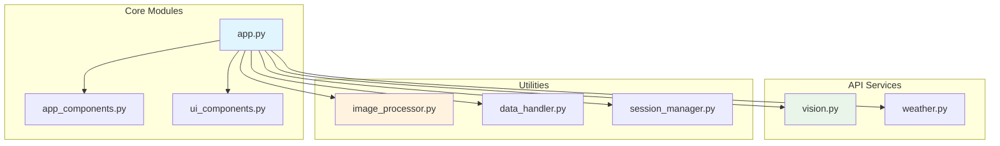

# API Reference

This section provides comprehensive documentation for all modules, classes, and functions in the Beehive Photo Metadata Tracker. The documentation is automatically generated from Python docstrings to ensure accuracy and consistency.

## Overview

The application is organized into several key modules:

<div class="grid cards" markdown>

-   :material-eye:{ .lg .middle } **Vision API**
    
    ---
    
    Google Cloud Vision API integration for computer vision analysis
    
    [:octicons-arrow-right-24: Vision API](vision.md)

-   :material-weather-cloudy:{ .lg .middle } **Weather API**
    
    ---
    
    Open-Meteo weather data integration and correlation
    
    [:octicons-arrow-right-24: Weather API](weather.md)

-   :material-image-edit:{ .lg .middle } **Image Processing**
    
    ---
    
    EXIF extraction, color analysis, and image utilities
    
    [:octicons-arrow-right-24: Image Processing](image-processing.md)

-   :material-database:{ .lg .middle } **Data Handling**
    
    ---
    
    Data persistence, validation, and export functionality
    
    [:octicons-arrow-right-24: Data Handling](data-handling.md)

-   :material-view-dashboard:{ .lg .middle } **UI Components**
    
    ---
    
    Streamlit components and visualization utilities
    
    [:octicons-arrow-right-24: UI Components](ui-components.md)

</div>

## Architecture Quick Reference



## Module Dependencies

Understanding the relationships between modules:

| Module | Dependencies | Purpose |
|--------|-------------|---------|
| `app.py` | All modules | Main application orchestration |
| `vision.py` | `google-cloud-vision` | Computer vision analysis |
| `weather.py` | `requests` | Weather data retrieval |
| `image_processor.py` | `PIL`, `colorthief` | Image analysis and metadata |
| `data_handler.py` | `pandas`, `json` | Data persistence and export |
| `session_manager.py` | `streamlit` | Session state management |

## Common Patterns

### Error Handling
All API modules implement consistent error handling:

```python
try:
    result = api_call()
    return result
except APIException as e:
    logger.error(f"API call failed: {e}")
    return fallback_response()
```

### Data Validation
Input validation follows a standard pattern:

```python
def validate_input(data: Dict) -> bool:
    """Validate input data structure."""
    required_fields = ["field1", "field2"]
    return all(field in data for field in required_fields)
```

### Session State Management
Consistent session state handling across components:

```python
if 'key' not in st.session_state:
    st.session_state.key = default_value
```

## Contributing to API Documentation

The API documentation is automatically generated from Python docstrings using the Google docstring format:

```python
def example_function(param1: str, param2: int = 0) -> Dict[str, Any]:
    """Brief description of the function.
    
    Longer description providing more detail about the function's
    purpose and behavior.
    
    Args:
        param1: Description of the first parameter.
        param2: Description of the second parameter with default.
        
    Returns:
        Dictionary containing the function result.
        
    Raises:
        ValueError: If param1 is empty.
        APIError: If external service is unavailable.
        
    Example:
        >>> result = example_function("test", 42)
        >>> print(result["status"])
        "success"
    """
    # Implementation here
    pass
```

## Quick Navigation

- **[Vision API](vision.md)**: Computer vision and image analysis
- **[Weather API](weather.md)**: Environmental data integration  
- **[Image Processing](image-processing.md)**: EXIF and color analysis
- **[Data Handling](data-handling.md)**: Storage and export utilities
- **[UI Components](ui-components.md)**: Interface and visualization components

---

*This documentation is automatically synchronized with the codebase to ensure accuracy and completeness.*