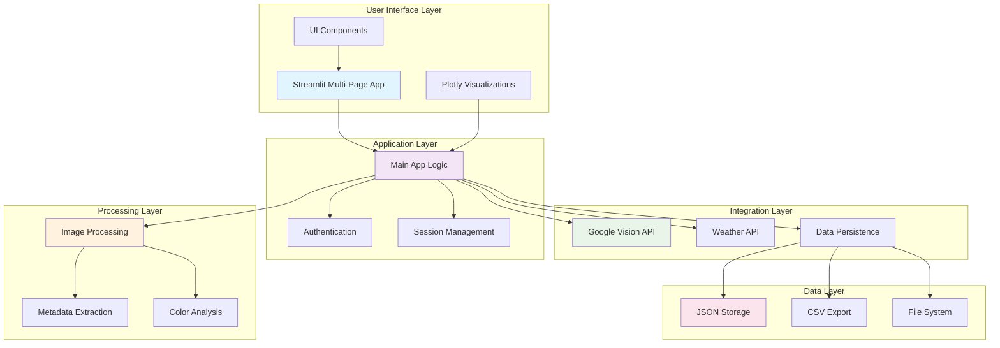
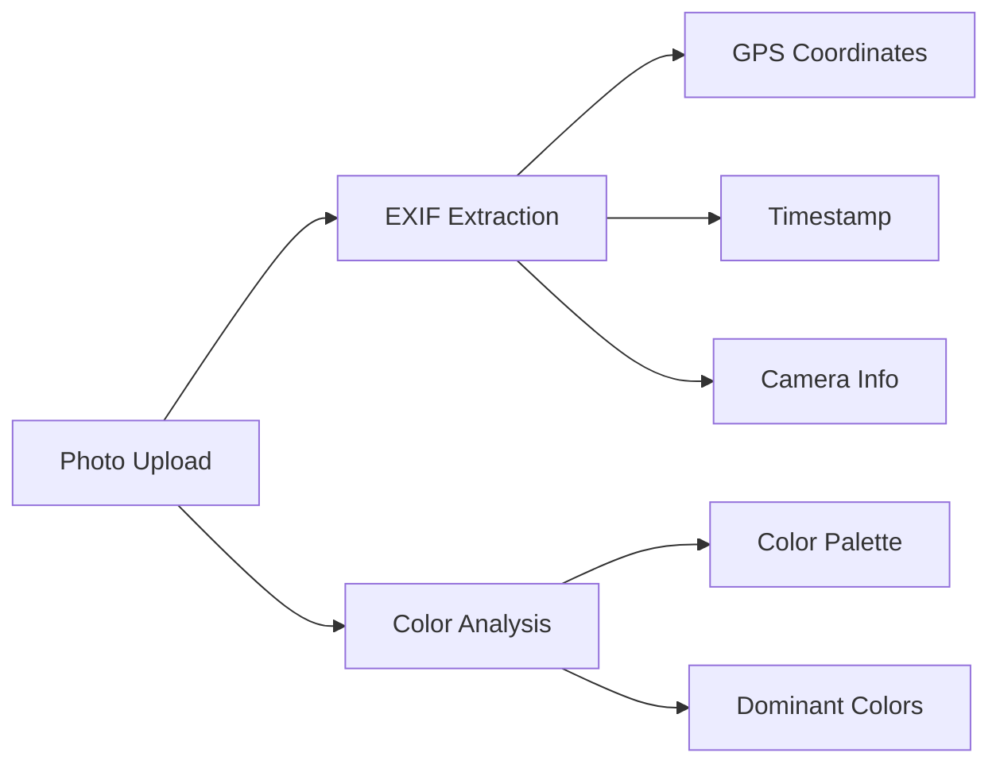
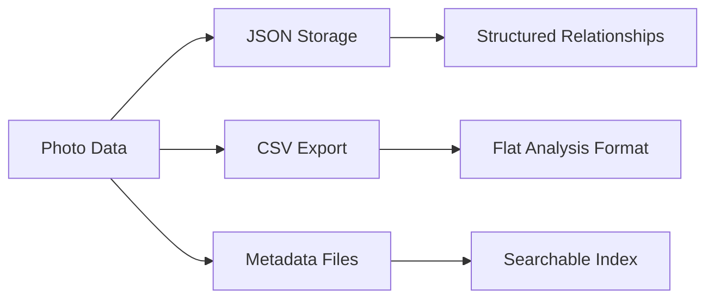
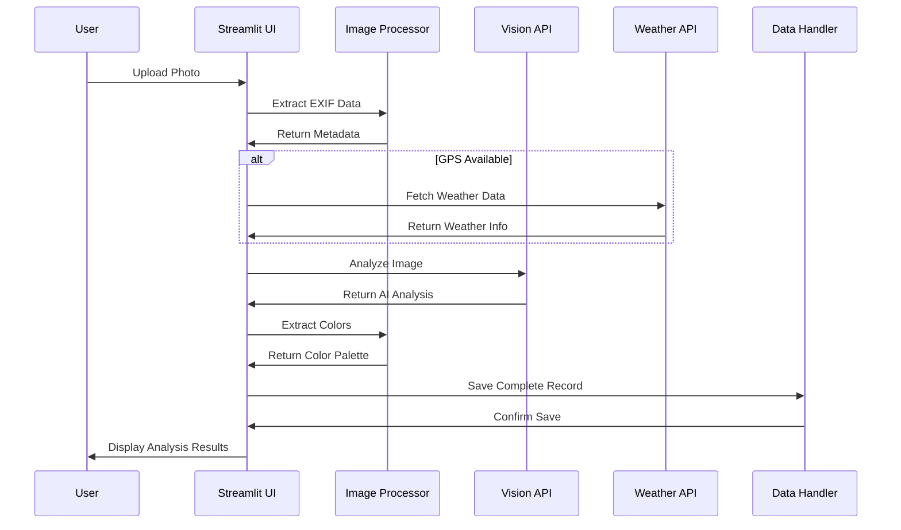

# System Architecture

The Beehive Photo Metadata Tracker follows a **multi-layered architecture** designed for performance, extensibility, and maintainability. This document provides a comprehensive overview of the system design and component interactions.

## High-Level Architecture



## Layer Details

### 1. User Interface Layer

The presentation layer built with **Streamlit** provides an intuitive multi-page web interface.

#### Components:
- **`run_tracker.py`**: Main entry point with navigation
- **`src/app.py`**: Primary dashboard and analysis interface
- **`src/calendar_view.py`**: Calendar-based timeline visualization
- **`src/gallery_view.py`**: Photo gallery with search and filtering
- **`src/login.py`**: Simple authentication system

#### UI Component Library:
```python
# Core reusable components
src/ui_components.py       # Basic UI elements
src/app_components.py      # Photo analysis components  
src/timeline_component.py  # Timeline visualization logic
```

### 2. Application Layer

The business logic layer that orchestrates user interactions and data flow.

#### Session Management:
```python
# Comprehensive session state management
src/utils/session_manager.py
```

Key session variables:
- `logged_in`: Authentication status
- `inspection_data`: Current analysis results
- `timeline_data`: Historical inspection data
- `color_analysis`: Extracted color palettes

### 3. Processing Layer

The core image analysis and metadata extraction engine.



#### Image Processing Pipeline:
```python
# Image analysis and metadata extraction
src/utils/image_processor.py
```

**EXIF Data Extraction:**
- GPS coordinates (lat/lng)
- Capture timestamp
- Camera make/model
- Technical settings (ISO, aperture, etc.)

**Color Analysis:**
- Dominant color extraction using ColorThief
- Color palette generation (5-color scheme)
- Color distribution analysis

### 4. Integration Layer

External API services that enrich photo data with additional context.

#### Google Cloud Vision API
```python
# Computer vision analysis
src/api_services/vision.py
```

**Capabilities:**
- Object detection (bees, honeycomb, equipment)
- Text recognition (hive labels, dates)
- Safety search (content filtering)
- Image properties analysis

#### Weather API Integration  
```python
# Weather data correlation
src/api_services/weather.py
```

**Features:**
- Historical weather data retrieval
- GPS-based location services
- Temperature, humidity, precipitation data
- API rate limiting and caching

### 5. Data Layer

Flexible storage system supporting multiple export formats.



#### Data Handler:
```python
# Data processing and validation
src/utils/data_handler.py
```

**Storage Formats:**
- **JSON**: Complex nested metadata with relationships
- **CSV**: Flattened format for Excel/analytics tools  
- **File System**: Organized photo storage with thumbnails

## Data Flow Architecture

### Photo Analysis Workflow



## Component Interactions

### Multi-Page Navigation
```python
# Navigation structure in run_tracker.py
pages = {
    "Dashboard": "src.app",
    "Timeline": "src.calendar_view", 
    "Gallery": "src.gallery_view"
}
```

### Session State Flow
```python
# Session persistence across pages
if 'inspection_data' not in st.session_state:
    st.session_state.inspection_data = {}
    
if 'logged_in' not in st.session_state:
    st.session_state.logged_in = False
```

## Security & Performance

### API Security
- Environment-based credential management
- Service account authentication for Google APIs
- Rate limiting and quota management

### Performance Optimizations
- Image thumbnail generation
- Session state caching
- Lazy loading of heavy components
- Asynchronous API calls where possible

### Error Handling
```python
# Consistent error patterns across services
try:
    result = api_call()
except APIException as e:
    log_error(e)
    return fallback_response()
```

## Deployment Architecture

### Docker Containerization
```dockerfile
# Multi-stage build for optimization
FROM python:3.11-slim AS base
# ... dependencies installation

FROM base AS production  
# ... application setup
EXPOSE 8080
CMD ["streamlit", "run", "run_tracker.py"]
```

### Cloud Deployment
- **Platform**: Google Cloud Run
- **Scaling**: Automatic based on traffic
- **Storage**: File-based with volume mounts
- **Environment**: Production/staging configurations

## Extensibility Points

### Adding New Analysis Features
1. Create new API service in `src/api_services/`
2. Register with data handler
3. Update UI components
4. Extend session state management

### Custom Visualization Components
1. Implement in `src/timeline_component.py`
2. Integrate with Plotly framework
3. Add to navigation structure

### New Export Formats
1. Extend `src/data_io.py`
2. Update data handler interface
3. Add UI export options

---

This architecture provides a solid foundation for current features while maintaining flexibility for future enhancements and scaling requirements.