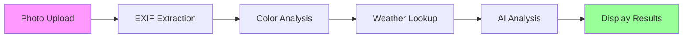
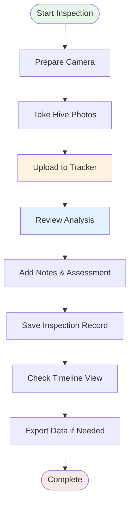

# Quick Start Guide

Get your first beehive photo analyzed in under 5 minutes! This guide walks you through the essential steps to start using the Beehive Photo Metadata Tracker.

!!! tip "Before You Begin"
    Make sure you have completed the [installation process](installation.md) and the application is running at `http://localhost:8501`.

## Step 1: Launch the Application

Open your web browser and navigate to:

```
http://localhost:8501
```

You should see the login screen. For the quickstart, you can use the default credentials or proceed if authentication is disabled in your configuration.

## Step 2: First Photo Upload

### Upload Your Photo

1. **Navigate to Dashboard**: Click on "Dashboard" in the sidebar (should be the default page)

2. **Choose Your Photo**: Click the "Browse files" button or drag and drop a beehive photo

3. **Supported Formats**: JPEG, PNG, TIFF, BMP, WEBP

!!! success "Photo Requirements"
    - **File Size**: Under 10MB for optimal performance
    - **Format**: Any common image format (JPEG recommended)
    - **Content**: Beehive, honeycomb, or bee-related photos work best
    - **Quality**: Higher resolution images provide better analysis results

### What Happens Next

Once uploaded, the application automatically:



## Step 3: Explore Your Results

### Metadata Section
You'll immediately see extracted information:

- **📅 Date & Time**: When the photo was taken
- **📍 Location**: GPS coordinates (if available)  
- **📷 Camera Info**: Make, model, and settings
- **🎨 Color Palette**: Dominant colors extracted from the image

### AI Analysis Results
If Google Vision API is configured:

- **🐝 Bee Detection**: Number and location of detected bees
- **🍯 Honeycomb Analysis**: Quality indicators and patterns
- **📝 Text Recognition**: Any visible labels or markings

### Weather Context
Environmental data for the photo date/location:

- **🌡️ Temperature**: High and low temperatures
- **💧 Humidity**: Atmospheric moisture levels
- **☔ Precipitation**: Rain or weather conditions

## Step 4: Add Your Observations

Enhance the automated analysis with your expert knowledge:

1. **Scroll to Annotations**: Find the "Add Your Notes" section

2. **Hive Assessment**: Rate the overall hive condition

3. **Observations**: Add specific notes about:
   - Queen presence or absence
   - Brood patterns observed
   - Honey stores levels
   - Any concerning indicators

4. **Tags**: Add relevant tags like "inspection", "treatment", "harvest"

## Step 5: Save Your Data

Don't lose your analysis! Save the complete inspection record:

1. **Click "Save Inspection"**: Stores all data locally

2. **Choose Export Format**: 
   - JSON for complete structured data
   - CSV for spreadsheet analysis

3. **Verify Save**: Check the success message

## Step 6: Explore Timeline View

See your inspection in context:

1. **Navigate to Timeline**: Click "Timeline" in the sidebar

2. **Interactive Chart**: Explore your inspection history

3. **Filter Options**: 
   - Date ranges
   - Hive locations  
   - Weather conditions

4. **Pattern Recognition**: Look for seasonal trends and patterns

## Quick Tips for Success

!!! tip "Getting Better Results"
    
    **📸 Photo Quality**
    - Use good lighting (avoid harsh shadows)
    - Keep the camera steady for sharp focus
    - Include scale references when possible
    
    **📱 EXIF Data**
    - Enable GPS on your camera/phone
    - Set correct date and time
    - Use consistent camera settings
    
    **🤖 AI Analysis**  
    - Upload photos with clear bee visibility
    - Avoid extreme close-ups that lose context
    - Multiple angles of the same hive provide richer data

## Troubleshooting Common Issues

### Photo Won't Upload
- **Check file size**: Must be under 10MB
- **Verify format**: Use JPEG, PNG, or other supported formats
- **Browser issues**: Try refreshing the page or using a different browser

### Missing GPS/Weather Data
- **No GPS coordinates**: Weather lookup requires location data
- **Camera settings**: Enable location services on your camera/phone  
- **Manual entry**: You can manually enter coordinates if needed

### AI Analysis Not Working
- **Check credentials**: Verify Google Cloud Vision API setup
- **Internet connection**: API calls require active internet
- **Image quality**: Low-quality images may not process well

### Slow Performance
- **Large files**: Resize images before upload for faster processing
- **Internet speed**: Weather and AI analysis require good connectivity
- **Browser memory**: Close other tabs if the browser becomes slow

## What's Next?

Now that you've successfully analyzed your first photo:

### 🔍 **Explore More Features**
- Try the [Calendar View](../user-guide/calendar-view.md) for date-based organization
- Check out the [Gallery View](../user-guide/gallery-view.md) for browsing all photos

### 📊 **Analyze Your Data**
- Learn about [data export options](../user-guide/data-export.md)
- Understand [metadata analysis](../user-guide/metadata-analysis.md) in detail

### ⚙️ **Customize Your Setup**  
- Configure [advanced settings](configuration.md)
- Set up [automated workflows](../user-guide/index.md)

## Example Workflow

Here's a typical inspection workflow using the application:



This workflow ensures you capture maximum value from each inspection while building a comprehensive historical record.

---

**Congratulations!** 🎉 You've successfully completed your first beehive photo analysis. The more you use the application, the richer your dataset becomes and the more insights you'll discover about your hive management practices.

Ready to dive deeper? Explore the complete [User Guide](../user-guide/index.md) for advanced features and techniques.