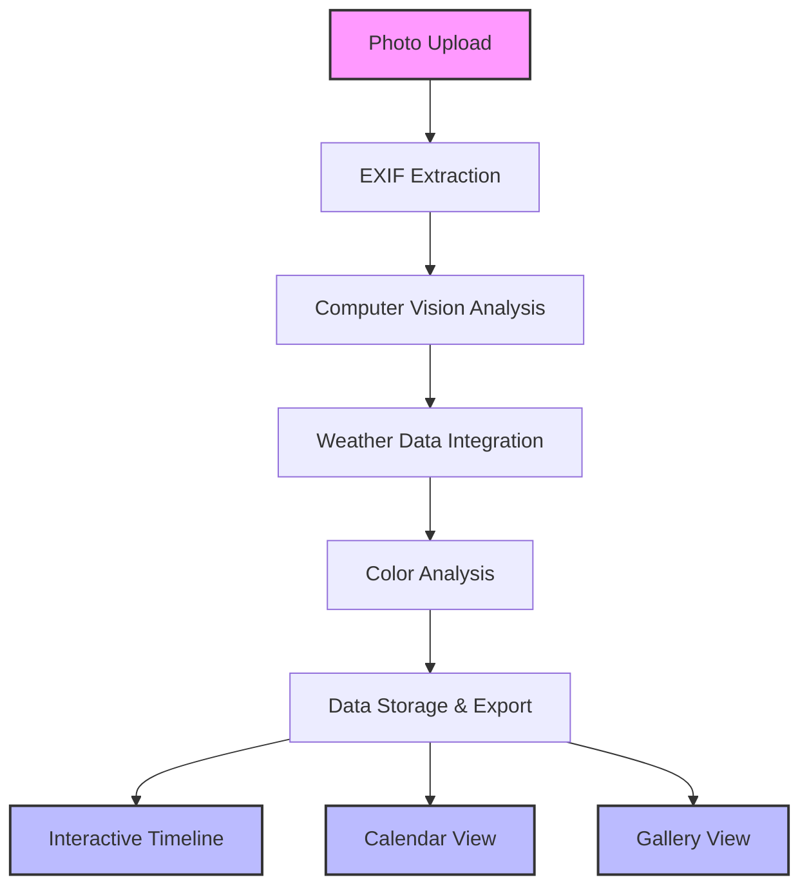

# 🐝 Beehive Photo Metadata Tracker

-   :material-clock-fast:{ .lg .middle } __Quick Start__

    ---

    Get up and running with the Beehive Tracker in minutes. Upload your first hive photo and see the magic happen.

    [:octicons-arrow-right-24: Getting Started](getting-started/index.md)

-   :material-image-multiple:{ .lg .middle } __Analyze Photos__

    ---

    Transform your beehive inspection photos into structured data with automated metadata extraction and AI analysis.

    [:octicons-arrow-right-24: User Guide](user-guide/index.md)

-   :material-api:{ .lg .middle } __API Reference__

    ---

    Comprehensive documentation for all APIs, modules, and functions in the application.

    [:octicons-arrow-right-24: API Docs](api-reference/index.md)

-   :material-rocket-launch:{ .lg .middle } __Deploy__

    ---

    Deploy your own instance to Google Cloud Run or run locally with Docker.

    [:octicons-arrow-right-24: Deployment Guide](deployment/index.md)

## Welcome to the Future of Beehive Management

The **Beehive Photo Metadata Tracker** is a cutting-edge web application that transforms unstructured beehive inspection photos into a **structured, searchable knowledge base**. Built for modern beekeepers who want to leverage data science and computer vision to enhance their apiculture practices.

!!! tip "🚀 Try the Live Demo"
    Experience the application firsthand at **[hivetracker.barbhs.com](https://hivetracker.barbhs.com)**

## Why Choose Beehive Tracker?

### :material-timeline-check: **Automated Timeline Creation**
Visualize your inspection history with interactive timelines that automatically organize photos by date and location.

### :material-camera-iris: **Computer Vision Analysis**
Leverage Google Cloud Vision API to automatically detect bees, honeycomb health indicators, and hive conditions.

### :material-weather-cloudy: **Environmental Context**
Integrate weather data to correlate hive conditions with environmental factors for better decision-making.

### :material-palette: **Color Analysis**
Extract color palettes from photos to identify honeycomb health patterns and seasonal variations.

### :material-database-export: **Export & Share**
Export your data to CSV/JSON formats for further analysis or sharing with fellow beekeepers.

### :material-docker: **Easy Deployment**
Deploy anywhere with Docker support - from local development to cloud production.

## Architecture at a Glance

## Technology Stack

Built with modern, reliable technologies:

- **Frontend**: Streamlit with Plotly visualizations
- **Backend**: Python with PIL, ColorThief, Pandas
- **APIs**: Google Cloud Vision, Open-Meteo Weather
- **Deployment**: Docker, Google Cloud Run
- **Storage**: Flexible file-based with JSON/CSV export

## What Makes This Special?

!!! quote "Data-Driven Beekeeping"
    "This application represents the intersection of traditional beekeeping knowledge and modern data science. By automatically extracting and organizing metadata from inspection photos, beekeepers can focus on what they do best - caring for their bees - while building a rich knowledge base for future reference."
    
    — **Barbara H. Smith**, *Data Scientist & Certified Data Management Professional (CDMP)*

## Key Features

- **🔍 Automated Metadata Extraction**: EXIF data, GPS coordinates, timestamps (1)
- **🎨 Color Palette Analysis**: Identify honeycomb health indicators through color
- **🌤️ Weather Integration**: Correlate inspections with environmental conditions  
- **📊 Interactive Timelines**: Visualize inspection history chronologically
- **📅 Calendar Views**: Organize photos by date and season
- **🖼️ Gallery Interface**: Browse and search your photo collection
- **📝 Annotation System**: Add notes and observations to each inspection
- **💾 Flexible Export**: CSV and JSON formats for external analysis

1.  GPS coordinates enable automatic weather data retrieval and location-based organization

## Get Started in 3 Steps

1. **[Install the application](getting-started/installation.md)** locally or via Docker
2. **[Upload your first beehive photo](getting-started/quick-start.md)** and see the analysis
3. **[Explore the timeline and gallery views](user-guide/index.md)** to organize your inspections

---

*Ready to revolutionize your beekeeping workflow? Let's get started!* 🐝