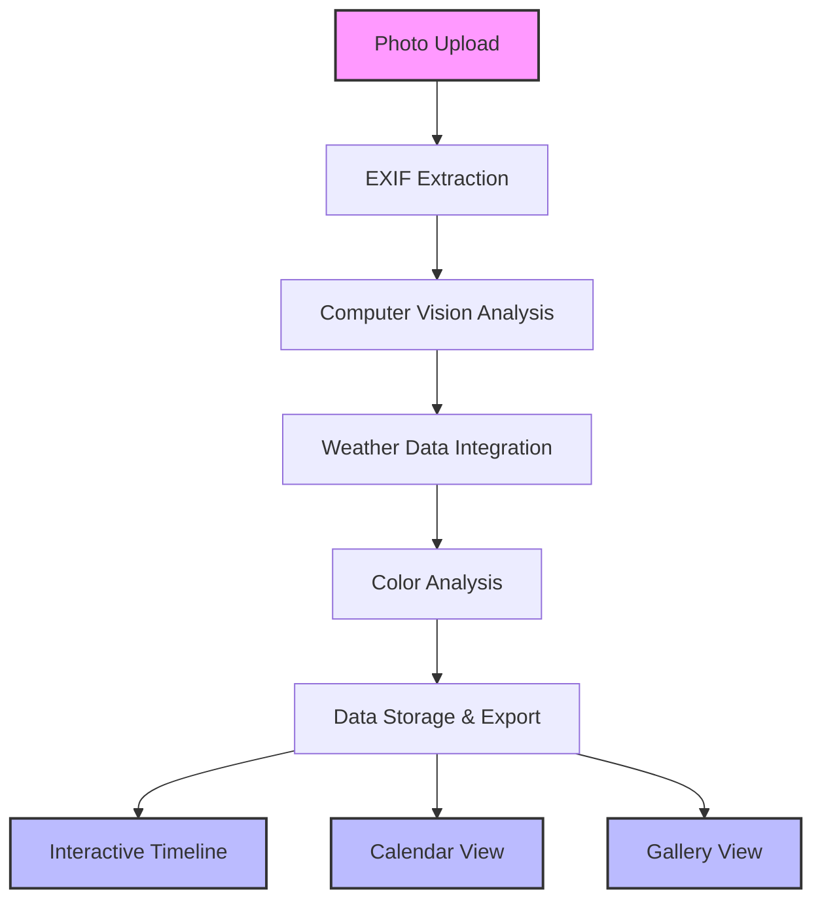

# 🐝 Beehive Photo Metadata Tracker

-   :material-clock-fast:{ .lg .middle } __Quick Start__

    ---

    Get up and running with the Beehive Tracker in minutes. Upload your first hive photo and see the magic happen.

    [:octicons-arrow-right-24: Getting Started](getting-started/index.md)

-   :material-image-multiple:{ .lg .middle } __Analyze Photos__

    ---

    Transform your beehive inspection photos into structured data with automated metadata extraction and AI analysis.

    [:octicons-arrow-right-24: User Guide](user-guide/index.md)

-   :material-api:{ .lg .middle } __API Reference__

    ---

    Comprehensive documentation for all APIs, modules, and functions in the application.

    [:octicons-arrow-right-24: API Docs](api-reference/index.md)

-   :material-rocket-launch:{ .lg .middle } __Deploy__

    ---

    Deploy your own instance to Google Cloud Run or run locally with Docker.

    [:octicons-arrow-right-24: Deployment Guide](deployment/index.md)

## About the Beehive Photo Metadata Tracker

The **Beehive Photo Metadata Tracker** helps beekeepers organize and analyze their inspection photos by automatically extracting metadata and providing insights. Upload your hive photos and get structured data about dates, locations, weather conditions, and visual analysis to track your hives over time.

This application enhances traditional beekeeping practices with thoughtful technology while respecting the craft and expertise of experienced beekeepers.

[:octicons-arrow-right-24: Learn more about our approach](about.md)

!!! tip "🚀 Try the Live Demo"
    Experience the application firsthand at **[hivetracker.barbhs.com](https://hivetracker.barbhs.com)**

## What You Can Do

### :material-timeline-check: **Automated Timeline Creation**
Visualize your inspection history with interactive timelines that automatically organize photos by date and location.

### :material-camera-iris: **Computer Vision Analysis**
Leverage Google Cloud Vision API to automatically detect bees, honeycomb health indicators, and hive conditions.

### :material-weather-cloudy: **Environmental Context**
Integrate weather data to correlate hive conditions with environmental factors for better decision-making.

### :material-palette: **Color Analysis**
Extract color palettes from photos to identify honeycomb health patterns and seasonal variations.

### :material-database-export: **Export & Share**
Export your data to CSV/JSON formats for further analysis or sharing with fellow beekeepers.

### :material-docker: **Easy Deployment**
Deploy anywhere with Docker support - from local development to cloud production.

## Architecture at a Glance

## Technology Stack

Built with modern, reliable technologies:

- **Frontend**: Streamlit with Plotly visualizations
- **Backend**: Python with PIL, ColorThief, Pandas
- **APIs**: Google Cloud Vision, Open-Meteo Weather
- **Deployment**: Docker, Google Cloud Run
- **Storage**: Flexible file-based with JSON/CSV export

## How It Helps Your Beekeeping

The application automatically extracts and organizes metadata from inspection photos, so you can focus on caring for your bees while building a comprehensive historical record for future reference.

### Traditional vs. Digital Approach

| Task | Traditional Method | With This Application |
|------|-------------------|----------------------|
| **Photo Organization** | Manual folder management | Automated timeline organization |
| **Record Keeping** | Handwritten notes | Automated extraction with your annotations |
| **Weather Context** | Memory or separate logs | Integrated historical weather data |
| **Finding Patterns** | Experience and memory | Visual timeline analysis |
| **Data Export** | Copying notes manually | Digital export to CSV/JSON |
| **Searching Records** | Manual file browsing | Search by date, weather, or tags |

## Key Features

- **🔍 Automated Metadata Extraction**: EXIF data, GPS coordinates, timestamps (1)
- **🎨 Color Palette Analysis**: Identify honeycomb health indicators through color
- **🌤️ Weather Integration**: Correlate inspections with environmental conditions  
- **📊 Interactive Timelines**: Visualize inspection history chronologically
- **📅 Calendar Views**: Organize photos by date and season
- **🖼️ Gallery Interface**: Browse and search your photo collection
- **📝 Annotation System**: Add notes and observations to each inspection
- **💾 Flexible Export**: CSV and JSON formats for external analysis

1.  GPS coordinates enable automatic weather data retrieval and location-based organization

## Get Started in 3 Steps

1. **[Install the application](getting-started/installation.md)** locally or via Docker
2. **[Upload your first beehive photo](getting-started/quick-start.md)** and see the analysis
3. **[Explore the timeline and gallery views](user-guide/index.md)** to organize your inspections

---

*Ready to organize your hive inspection photos? Let's get started!* 🐝