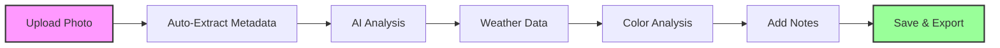

# User Guide

Welcome to the comprehensive user guide for the Beehive Photo Metadata Tracker! This guide will walk you through all the features and capabilities of the application, helping you maximize its value for your beekeeping operations.

## Interface Overview

The application features a **clean, intuitive interface** built with Streamlit, offering three main views for analyzing and organizing your beehive inspection photos:

<div class="grid cards" markdown>

-   :material-upload:{ .lg .middle } **Dashboard**

    ---

    Upload photos, view analysis results, and manage inspection data

    [:octicons-arrow-right-24: Photo Upload Guide](photo-upload.md)

-   :material-timeline:{ .lg .middle } **Timeline View**

    ---

    Visualize inspection history chronologically with interactive charts

    [:octicons-arrow-right-24: Timeline Guide](timeline-view.md)

-   :material-calendar:{ .lg .middle } **Calendar View**

    ---

    Organize inspections by date and season for easy reference

    [:octicons-arrow-right-24: Calendar Guide](calendar-view.md)

-   :material-view-grid:{ .lg .middle } **Gallery View**

    ---

    Browse and search your photo collection with rich metadata

    [:octicons-arrow-right-24: Gallery Guide](gallery-view.md)

</div>

## Quick Workflow

Here's the typical workflow for analyzing beehive photos:



1. **[Upload Photo](photo-upload.md)** - Select and upload your beehive inspection photo
2. **[Review Analysis](metadata-analysis.md)** - Examine automatically extracted metadata and AI insights
3. **[Add Context](photo-upload.md#adding-annotations)** - Include your observations and notes
4. **[Explore Timeline](timeline-view.md)** - View your inspection history and identify patterns
5. **[Export Data](data-export.md)** - Download your data for further analysis

## Key Features

### 🔍 **Automated Metadata Extraction**

Every uploaded photo is automatically analyzed to extract:

- **EXIF Data**: Camera settings, GPS coordinates, timestamps
- **Color Palettes**: Dominant colors and color distribution
- **Technical Details**: Image dimensions, file size, format

[Learn more about metadata analysis →](metadata-analysis.md)

### 🤖 **AI-Powered Analysis**

Integration with Google Cloud Vision API provides:

- **Object Detection**: Identify bees, honeycomb, and equipment
- **Text Recognition**: Extract hive labels and annotations  
- **Content Classification**: Categorize image content automatically

### 🌤️ **Weather Integration**

Correlate your inspections with environmental conditions:

- **Historical Weather Data**: Temperature, humidity, precipitation
- **Location-Based Services**: Automatic weather lookup using GPS coordinates
- **Seasonal Analysis**: Track how weather affects hive activity

### 📊 **Interactive Visualizations**

Rich visual analytics powered by Plotly:

- **Timeline Charts**: Chronological inspection history
- **Color Analysis**: Visual representation of honeycomb health
- **Geographic Mapping**: Plot hive locations and inspection patterns

## Navigation Tips

### Multi-Page Interface
The application uses Streamlit's multi-page functionality with persistent session state:

- **Sidebar Navigation**: Quick access to all pages
- **Session Persistence**: Data remains available across page changes
- **Breadcrumb Trail**: Always know where you are in the application

### Keyboard Shortcuts
| Shortcut | Action |
|----------|--------|
| `Ctrl + U` | Upload new photo |
| `Ctrl + S` | Save current data |
| `Ctrl + E` | Export to CSV |
| `←` `→` | Navigate timeline |

## Data Organization

### File Structure
Your data is organized in a logical hierarchy:

```
data/
├── uploads/           # Original uploaded photos
├── thumbnails/        # Generated thumbnails
├── metadata/          # JSON metadata files
└── exports/          # CSV and other export formats
```

### Data Formats

- **JSON**: Rich, structured data for complex relationships
- **CSV**: Flat format for Excel and analysis tools
- **Images**: Original photos plus generated thumbnails

[Learn more about data export →](data-export.md)

## Common Questions

??? question "How accurate is the bee detection?"
    The AI analysis achieves approximately 85-90% accuracy in detecting bees under good lighting conditions. Accuracy may vary based on:
    
    - Photo quality and lighting
    - Bee activity level and positioning
    - Camera angle and distance
    
    The system provides confidence scores for all detections to help you assess reliability.

??? question "Can I use this without internet access?"
    Basic functionality (photo upload, EXIF extraction, color analysis) works offline. However, these features require internet connectivity:
    
    - Google Cloud Vision API analysis
    - Weather data retrieval
    - Map visualizations
    
    Data is stored locally and can be analyzed offline after initial processing.

??? question "What image formats are supported?"
    The application supports all common image formats:
    
    - **JPEG/JPG** (recommended for photos)
    - **PNG** (supports transparency)
    - **TIFF** (high-quality, large files)
    - **BMP** (basic bitmap format)
    - **WEBP** (modern, compressed format)

??? question "How do I backup my data?"
    Your data can be backed up in multiple ways:
    
    1. **Export to CSV** for spreadsheet analysis
    2. **Copy the data/ folder** for complete backup
    3. **Use git** if you've initialized the project folder as a repository
    4. **Cloud storage** integration (coming in future updates)

??? question "Can multiple beekeepers share data?"
    Currently, the application is designed for single-user operation. Multi-user features are planned for future releases. For now, you can:
    
    - Share exported CSV files
    - Use version control (git) for collaboration
    - Deploy separate instances for different users

## Getting Help

!!! tip "Need More Help?"
    - Check the specific page guides for detailed instructions
    - Review the [troubleshooting section](../getting-started/installation.md#troubleshooting)
    - Visit the [GitHub repository](https://github.com/dagny099/beehive-tracker) for community support
    - Contact support through the repository issues page

## What's Next?

Ready to dive deeper? Here are the recommended next steps:

1. **[Master Photo Upload](photo-upload.md)** - Learn all upload options and features
2. **[Explore Timeline View](timeline-view.md)** - Visualize your inspection patterns  
3. **[Understand Metadata](metadata-analysis.md)** - Get the most from automated analysis
4. **[Export Your Data](data-export.md)** - Use your data in external tools

---

*Transform your beekeeping practice with data-driven insights! Let's explore each feature in detail.* 🐝